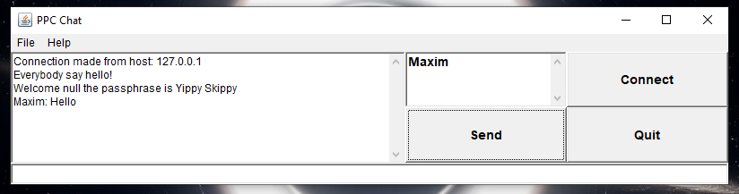
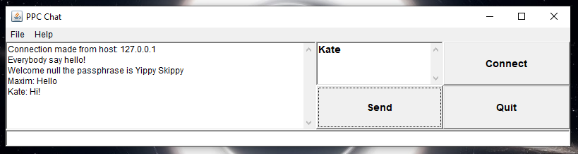
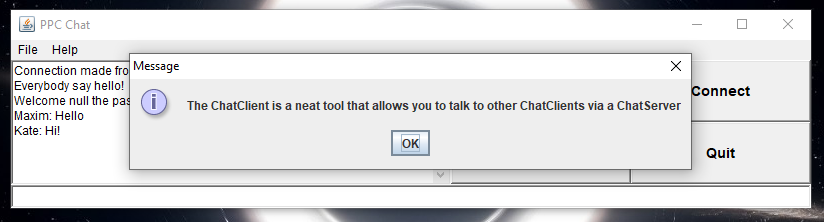
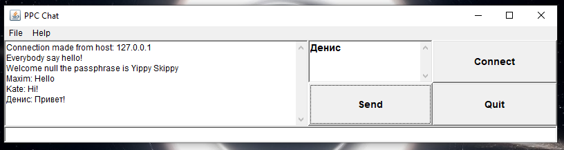

# Результат

## Завдання на "п'ять"
1.позбавтесь від використання файлу хостів в коді сервера (розберіться як він працює та змініть так аби позбавитись помилок при його запуску)
2.реалізуйте підтримку кирилиці - кодування UTF-8 (потрібну для цього інформацію ви знайдете тут)

